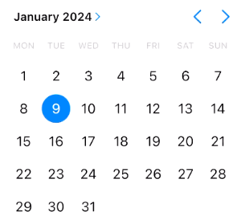

# Compose Cupertino Adaptive

> [!NOTE]  
> This page describes the adaptive widgets. For the iOS-style widgets, see [Cupertino.md](Cupertino.md).

A quick-start tutorial, showing how to use the theme and replace default components with the adaptive ones, is available
at https://medium.com/@jacobras/getting-the-native-ios-look-feel-in-your-compose-multiplatform-app-33371e6ad362.

# Theme

To use components from the library, your app theme needs to incorporate `AdaptiveTheme`:

```kotlin
@Composable
fun AppTheme(
    theme: Theme,
    content: @Composable () -> Unit
) {
    AdaptiveTheme(
        material = {
            // Tweak this for your Material design
            MaterialTheme(content = it)
        },
        cupertino = {
            // Tweak this for your iOS design
            CupertinoTheme(content = it)

        },
        target = theme,
        content = content
    )
}
```

# Available components

All components work in light and dark mode. Note that the list below might be incomplete, check the source code to find
all
available components.

## Buttons

iOS-style buttons. Usage: `AdaptiveButton` or `AdaptiveIconButton`.


## Date picker

An iOS-style date picker. Usage: `AdaptiveDatePicker`.



## Dialog

An iOS-style dialog. Usage: `AdaptiveDialog` or  `AdaptiveDialogNative`.


## Divider

An iOS-style divider. Usage: `AdaptiveDivider`.

## Navigation bar

An iOS-style navigation bar. Usage: `AdaptiveCupertinoNavigationBar`. For the items, use `AdaptiveNavigationBarItem`.


## Progress indicator

An iOS-style progress indicator. Usage: `AdaptiveCircularProgressIndicator`.

## Scaffold

Basic visual layout structure, recommended to use with the top bar and navigation bar. Usage: `AdaptiveScaffold`.

## Slider

An iOS-style slider that allow users to make selections from a range of values. Usage: `AdaptiveSlider`.

## Switch

An iOS-style switch. Usage: `AdaptiveSwitch`.


## Theme

Adaptive theme depending on the passed in `target`. It allows to seamlessly use Material and Cupertino widgets. Required
to use the other components, see [Theme](#theme).

## Top app bar

An iOS-style top app bar. Usage: `AdaptiveTopAppBar`.


# Custom components

All adaptive components use `AdaptiveWidget` to switch between Material and Cupertino design. You can also use it
yourself:

```kotlin
@Composable
fun MyWidget() {
    AdaptiveWidget(
        material = { Text("Your Material design here") },
        cupertino = { Text("Your Cupertino design here") }
    )
}
```