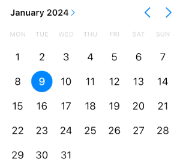
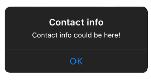
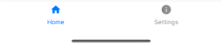
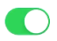
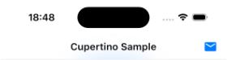

# Compose Cupertino

> [!NOTE]
> This page describes the iOS-style widgets. For the adaptive widgets, see [Adaptive.md](Adaptive.md).

# Theme

To use components from the library, your app theme needs to `CupertinoTheme`:

```kotlin
@Composable
fun AppTheme(
    content: @Composable () -> Unit
) {
    CupertinoTheme(content = content)
}
```

# Available components

All components work in light and dark mode. Note that the list below might be incomplete, check the source code to find
all
available components.

## Buttons

iOS-style buttons. Usage: `CupertinoButton` or `CupertinoIconButton`.


## Date picker

An iOS-style date picker. Usage: `CupertinoDatePicker`.



## Dialog

An iOS-style dialog. Usage: `CupertinoDialog` or  `CupertinoDialogNative`.



## Divider

An iOS-style divider. Usage: `CupertinoDivider`.

## Navigation bar

An iOS-style navigation bar. Usage: `CupertinoNavigationBar`. For the items, use `CupertinoNavigationBarItem`.



## Progress indicator

An iOS-style progress indicator. Usage: `CupertinoActivityIndicator`.

## Scaffold

Basic visual layout structure, recommended to use with the top bar and navigation bar. Usage: `CupertinoScaffold`.

## Slider

An iOS-style slider that allow users to make selections from a range of values. Usage: `CupertinoSlider`.

## Switch

An iOS-style switch. Usage: `CupertinoSwitch`.



## Top app bar

An iOS-style top app bar. Usage: `CupertinoTopAppBar`.

